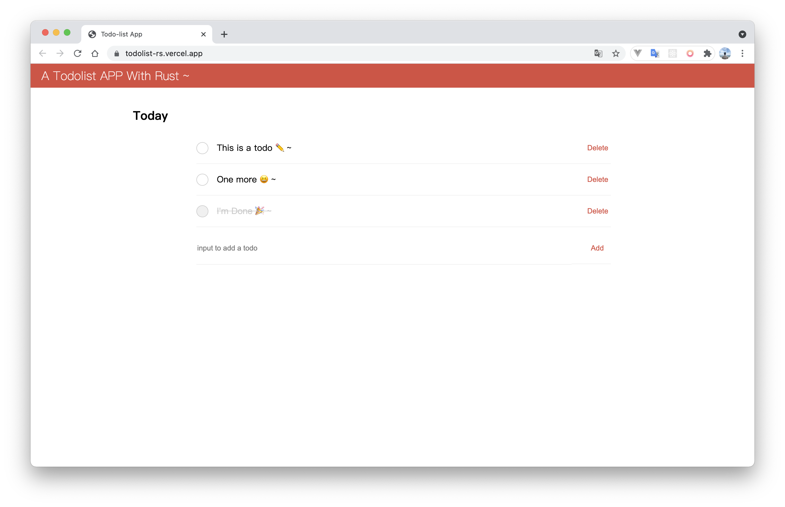

# todolist-rs

A TodoList App With Rust & yew ~ ✏️

## Demo


## Usage

```
git clone https://github.com/Baoyuantop/todolist-rs.git

cd todolist-rs

wasm-pack build --target web --out-name wasm --out-dir ./static
```

Then use a service like [serve](https://www.npmjs.com/package/serve) to host files under `static`.

## Todo

- [ ] todo and done status
- [ ] storage


### Contributors

This project exists thanks to all the people who contribute. 
